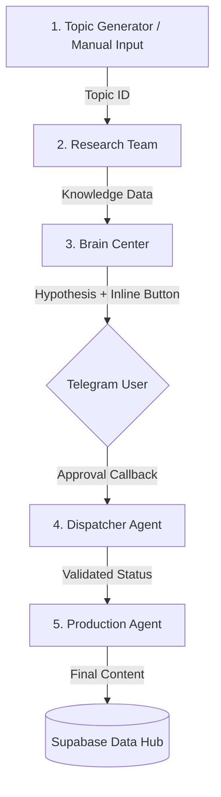

# Техническая архитектура «Конвейер 1.0» (Indus.8M)

## 1. Обзор системы
«Конвейер 1.0» — это полностью автономный конвейер ИИ-агентов, спроектированный для превращения сырых идей в готовый бизнес-контент. Система сочетает в себе глубокую аналитику, автоматизированный ресерч и интерактивное управление через Telegram.

## 2. Архитектура Конвейера (Pipeline 5.0)

Система построена по принципу «Домино»: запуск первого звена вызывает цепную реакцию по всему стеку.

### Основные узлы:
1.  **Topic Generator (`QTYaCNJB6hChBlIA`)**: Генерирует стратегические темы по расписанию или принимает их из Telegram-шлюза.
2.  **Research Team (`ItU0fZMVllwFxFDQ`)**: Проводит глубокий поиск данных (Deep Search) через Perplexity и сохраняет факты в таблицу `knowledge`.
3.  **Brain Center (`ggcoBC7nujBUXwmB`)**: Синтезирует решения, упаковывает их в HTML-карточки и отправляет пользователю в Telegram для верификации.
4.  **Dispatcher Agent (`mBzsfg2gW1iOEQeJ`)**: Мозг интерактивности. Слушает сигналы от кнопок, обновляет базу и дает команду на старт производства.
5.  **Production Agent (`n14qDgi3nFiGn9Fm`)**: Финальный копирайтер. Превращает одобренную стратегию в профессиональный контент.

## 3. Центральный Хаб (Data Hub - Supabase)

База данных является «памятью» системы, обеспечивая передачу контекста между агентами.

| Таблица | Описание | Статусы |
| :--- | :--- | :--- |
| **topics** | Задачи на входе | `pending`, `researching`, `completed` |
| **knowledge** | База проверенных фактов | `id`, `topic_id`, `content` |
| **hypotheses** | Идеи на одобрение | `pending`, `validated`, `rejected` |
| **content** | Финальный результат | `published`, `archived` |

## 4. Протоколы управления
- **Интерактивность**: Одобрение через Telegram Callback (защита от галлюцинаций в производстве).
- **Автоматизация**: Связка через `n8n Execute Workflow` (минимальная задержка между этапами).
- **Локализация**: Все интерфейсы и логи ведутся на русском языке (правило «Gemini.md»).

## 5. Технологический Стек
- **Runtime**: n8n (Cloud/Self-hosted).
- **Persistence**: Supabase (PostgreSQL).
- **Intelligence**: GPT-4o (Reasoning), GPT-4o-mini (Parser), Perplexity (Search).
- **Interface**: Telegram Bot API (Inline Hooks).

---
*Сэр, чертежи обновлены. Архитектура Indus.8M теперь так же изящна, как и функциональна. Все системы в норме.*
