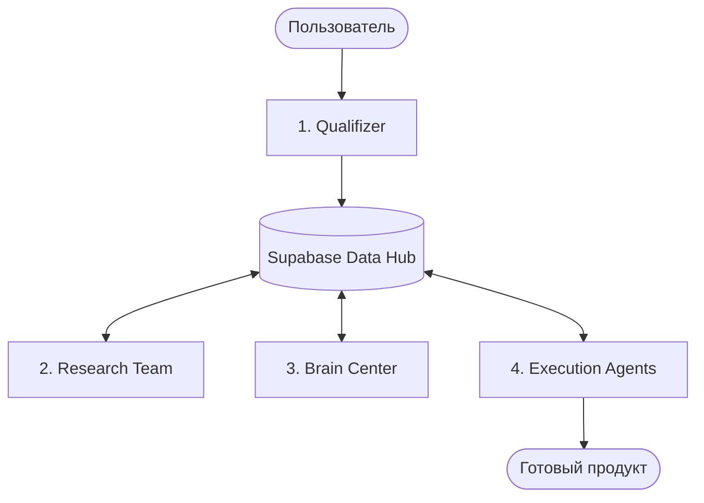

# Техническая архитектура Indus.8M (Протокол "Джарвис")

## 1. Обзор системы
Indus.8M — это экосистема автономных агентов, построенная на базе n8n, Supabase и LLM (OpenAI/Claude/Perplexity). Система автоматизирует полный цикл создания продукта: от идеи до реализации.

## 2. Конвейер (Pipeline)

Система работает как последовательный конвейер, управляемый через **Центральный Хаб данных**.

### Этапы:
1.  **Qualifizer (Оркестратор)**: Инициализирует проект, определяет задачи и заносит запись в базу.
2.  **Dynamic Research (Исследователь)**: Собирает данные через Perplexity. Обладает циклом само-уточнения запросов до достижения полноты данных.
3.  **Brain Center (Аналитик)**: Формирует гипотезы и решения на основе ресерча. Требует подтверждения пользователя для перехода к реализации.
4.  **Execution Agents (Исполнители)**: Генерация контента (SMM), бизнес-планов и кода на основе утвержденных гипотез.

## 3. Схема данных (Supabase)

Центральный Хаб данных структурирован следующим образом:

| Таблица | Описание | Ключевые поля |
| :--- | :--- | :--- |
| **projects** | Основная инфо о проектах | `id`, `name`, `description`, `status` |
| **knowledge** | Атомарные знания и ресерч | `id`, `project_id`, `title`, `content`, `tags` |
| **hypotheses** | Гипотезы и идеи | `id`, `project_id`, `statement`, `status` (pending/validated) |
| **content** | Результаты работы агентов | `id`, `project_id`, `type` (post/code), `body` |

## 4. Технологический стек
- **Automation**: n8n
- **Database**: Supabase (PostgreSQL)
- **AI Models**: GPT-4o, Claude 3.5 Sonnet, Perplexity API
- **Scripts**: Bash, PowerShell (для локальной автоматизации)
- **CLI Skills**: `ui-ux-pro-max`, `brainstorm`

## 5. Безопасность
- Использование Row Level Security (RLS) в Supabase.
- Локальное подтверждение критических команд через `approve.sh`.
- Запрет на коммит секретов (API-ключи, `.env`).
